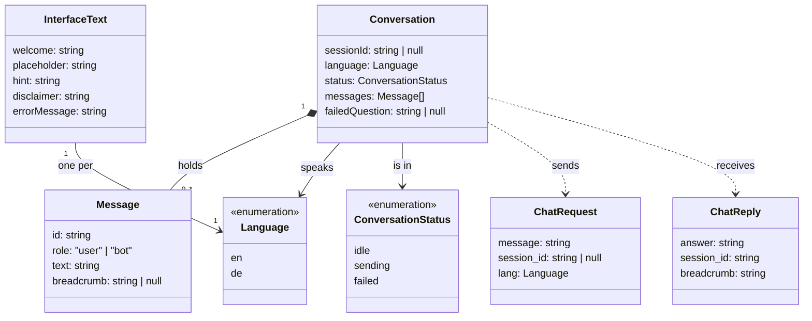
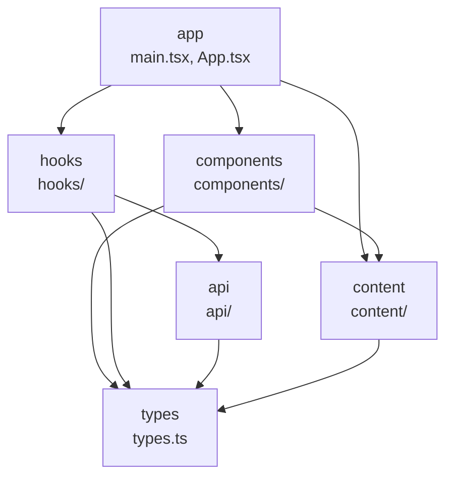

# Atlas Frontend Architecture

## Class diagram

The things the frontend keeps track of, their fields, and how they relate. It covers all eight Phase 4 tickets, not only the P0 ones, so the structure does not have to change when the P1 and P2 tickets are built.

- **Conversation**: one chat session. `sessionId` is `null` until the first answer arrives. `failedQuestion` keeps the question that failed, so it can be retried.
- **Message**: one bubble. `breadcrumb` is only set on bot messages.
- **ChatRequest / ChatReply**: the shape of `POST /chat` on the backend. Field names follow the backend (`session_id`, `lang`).
- **InterfaceText**: every piece of text the interface shows, including the welcome message. One set per language. See [decision 001](../decisions/001-welcome-message-is-interface-text.md).

## Package diagram

The layers of `frontend/src` and the direction they depend on each other. An arrow means "imports from". Imports only go downwards. A lower layer never imports a higher one.

| Layer | Folder | Does | May import |
|---|---|---|---|
| app | `main.tsx`, `App.tsx` | Puts the screen together and passes data to the components. | components, hooks, content, types |
| components | `components/` | Draws the interface from the props it gets. Does not talk to the backend. | content, types |
| hooks | `hooks/` | Holds the conversation state and its rules (sending, failing, retrying, resetting). | api, types |
| api | `api/` | Sends `POST /chat` and turns the reply into a `ChatReply`. | types |
| content | `content/` | Interface text, one file per language. | types |
| types | `types.ts` | The types from the class diagram. | nothing |

Rules:

1. No layer imports a layer above it.
2. `components` never imports `api` or `hooks`. Data reaches a component only through props. See [decision 002](../decisions/002-only-hooks-talk-to-the-backend.md).
3. `types` imports nothing from the project.
4. No circular imports.
