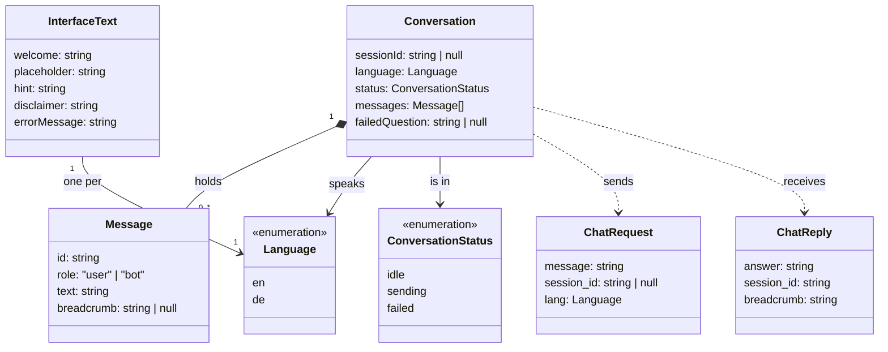

# Atlas Frontend Architecture

## Class diagram

The things the frontend keeps track of, their fields, and how they relate. It covers all eight Phase 4 tickets, not only the P0 ones, so the structure does not have to change when the P1 and P2 tickets are built.

- **Conversation**: one chat session. `sessionId` is `null` until the first answer arrives. `failedQuestion` keeps the question that failed, so it can be retried.
- **Message**: one bubble. `breadcrumb` is only set on bot messages.
- **ChatRequest / ChatReply**: the shape of `POST /chat` on the backend. Field names follow the backend (`session_id`, `lang`).
- **InterfaceText**: every piece of text the interface shows, including the welcome message. One set per language. See [decision 001](../decisions/001-welcome-message-is-interface-text.md).
